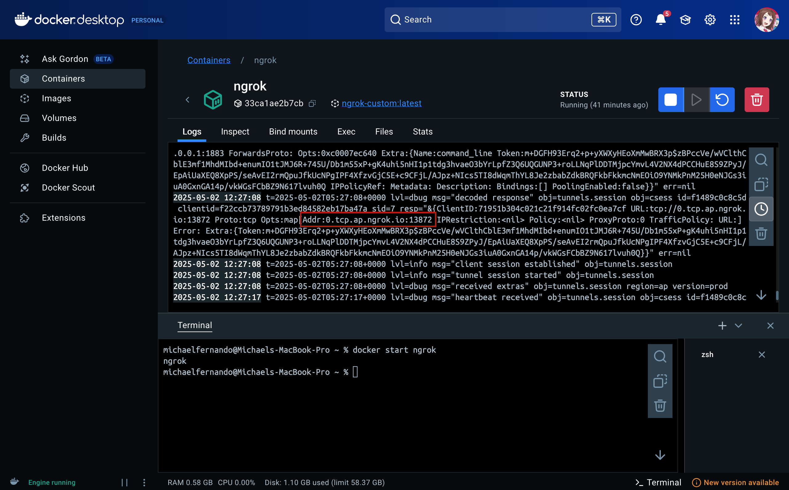

# MQTT-Local-Server-Docker

## MQTT Local Server Docker merupakan Command yang berisi untuk menjalankan local server dengan menggunakan docker sebagai perantara server

Berikut merupakan langkah untuk menjalankan nya :

1. Jalankan Perintah command di docker :
```
Docker build -t <nama_image> -f ngrok_mosquitto.dockerfile .
```
2. Lalu, Jalankan perintah command docker run :
```
Docker run -t -name <nama_container> <nama_image>

dan voila local server akan jalan seperti gambar di bawah ini

